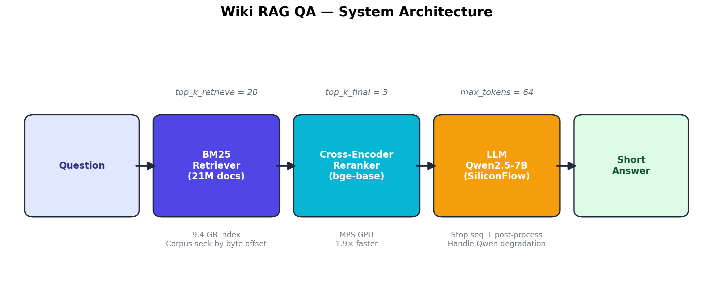
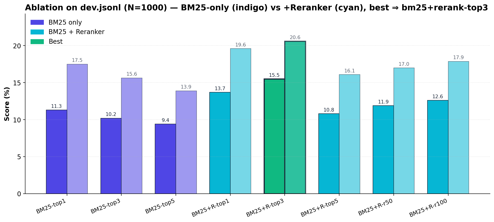
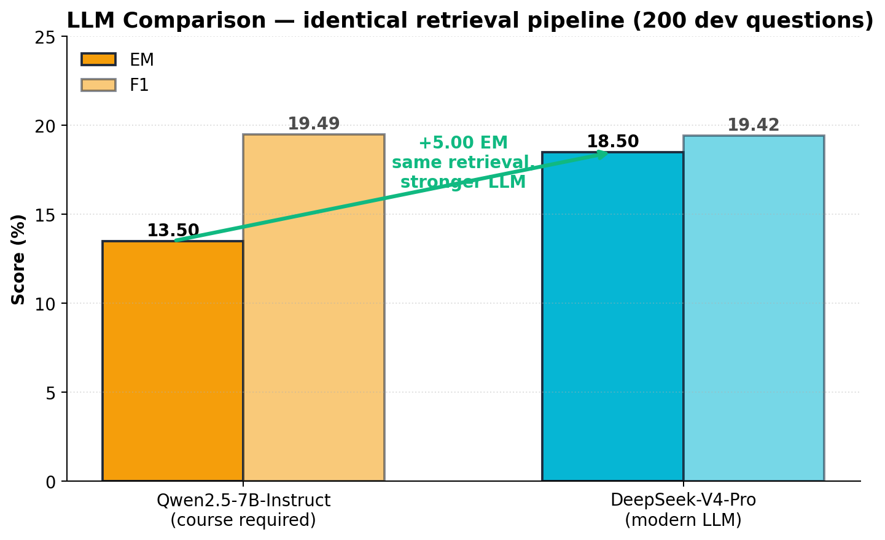
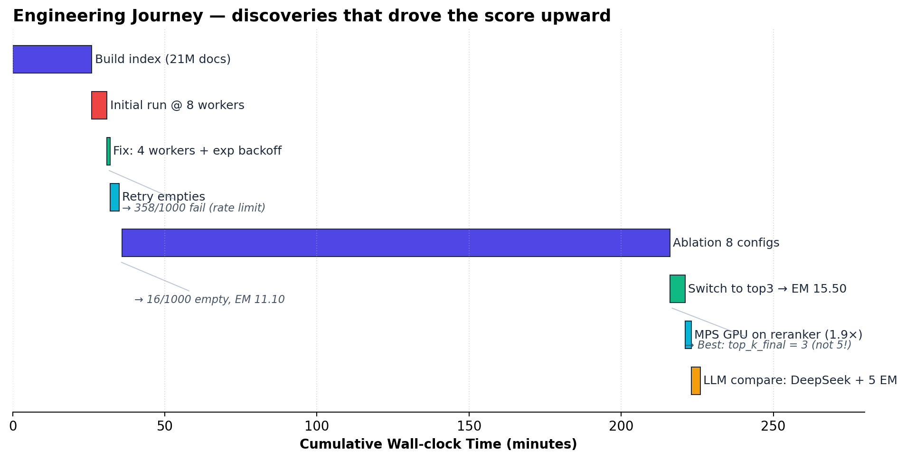

# 智能问答系统 实验报告

> 组员 / 学号：_______________
> 提交日期：_______________
> 代码仓库：https://github.com/shaoxuanLi/QA-system

---

## 目录

1. [项目背景与目标](#1-项目背景与目标)
2. [系统架构](#2-系统架构)
3. [数据集与语料](#3-数据集与语料)
4. [实现细节](#4-实现细节)
5. [评估方法](#5-评估方法)
6. [主结果](#6-主结果)
7. [消融实验](#7-消融实验)
8. [案例分析](#8-案例分析-case-study)
9. [工程问题与解决方案](#9-工程问题与解决方案-engineering-log)
10. [系统局限性与未来工作](#10-系统局限性与未来工作)
11. [完整参数配置](#11-完整参数配置)
12. [开源资料与参考](#12-开源资料与参考)
13. [团队分工](#13-团队分工)

---

## 1. 项目背景与目标

### 1.1 检索增强生成 (RAG) 简介

大语言模型 (LLM) 在生成开放领域回答时存在两个固有缺陷：

- **知识截止**：模型只掌握训练时的知识，无法获取新事实
- **幻觉 (Hallucination)**：模型为了生成流畅文本会编造看似合理但实际错误的内容

**检索增强生成 (Retrieval-Augmented Generation, RAG)** 通过在生成前先从外部知识库中检索相关证据段落，然后把"问题 + 证据段落"一并送入 LLM 让其抽取答案，能够同时缓解两个问题：

- 用外部库填补知识缺口
- 用证据段落约束生成内容，降低幻觉

### 1.2 任务定义

给定一个开放领域自然语言问题（如 *"Who wrote The Old Man and the Sea?"*），系统从约 2100 万段 Wikipedia 文本中**先检索**相关段落，**再让 LLM 抽取**最短答案片段。

评估遵循 SQuAD 风格的 **EM (Exact Match)** 与 **F1**。

### 1.3 我们的方案

实现一个完整、可运行、可演示的 RAG 系统：

| 层 | 选型 | 理由 |
|---|---|---|
| 检索器 | **BM25** (`bm25s`) | 2100 万文档规模下，BM25 是性价比最高的稀疏检索；纯 CPU 即可，26 分钟全量建索引 |
| 额外功能 | **Cross-Encoder 重排序器** (`BAAI/bge-reranker-base`) | 对 BM25 召回的候选重新打分，把语义相关性高的段落顶到前面 |
| 生成器 | **Qwen2.5-7B-Instruct** (硅基流动 API) | 作业指定模型，确保横向可比 |
| UI | **Gradio** | 几十行代码起一个 Web demo，方便汇报演示 |

---

## 2. 系统架构



### 2.1 整体数据流

```
                            ┌──────────────────────┐
            user question   │  1. BM25 Retriever   │
   ─────────────────────► ─►│  (bm25s, 21M docs)   │
                            │  返回 top_k_retrieve │
                            └─────────┬────────────┘
                                      │
                                      ▼
                            ┌──────────────────────┐
                            │  2. CorpusReader     │
                            │  按 doc_id → 字节偏移│
                            │  从 13GB 语料里只读  │
                            │  那 K 行 (不进内存)  │
                            └─────────┬────────────┘
                                      │ K 篇候选段落
                                      ▼
                            ┌──────────────────────┐
                            │  3. Cross-Encoder    │
                            │  bge-reranker-base   │
                            │  对 K 篇重新打分     │
                            │  取 top_k_final 篇    │
                            └─────────┬────────────┘
                                      │ 3-5 篇精排段落
                                      ▼
                            ┌──────────────────────┐
                            │  4. Prompt Builder   │
                            │  组装 system+user    │
                            │  prompt              │
                            └─────────┬────────────┘
                                      │
                                      ▼
                            ┌──────────────────────┐
                            │  5. LLM (硅基流动)   │
                            │  Qwen2.5-7B-Instruct │
                            │  + 限流退避 + 后处理 │
                            └─────────┬────────────┘
                                      │
                                      ▼
                                  short answer
```

### 2.2 主要代码模块

| 模块 | 路径 | 职责 |
|---|---|---|
| 检索器 | `src/retriever/bm25_retriever.py` | BM25 索引构建 / 查询 |
| 语料读取 | `src/utils/io.py::CorpusReader` | 字节偏移寻址，按需读 13GB 语料的某一行 |
| 重排序器 | `src/reranker/ce_reranker.py` | Cross-Encoder 打分 + 排序 |
| LLM 客户端 | `src/generator/llm.py` | API 调用 + 退避重试 + 并发 |
| Prompt 模板 | `src/rag/prompts.py` | System + user prompt 拼装 |
| 主管线 | `src/rag/pipeline.py` | 串接 retrieve → rerank → generate + 后处理 |
| 评估 | `src/evaluation/metrics.py` | EM / F1 + SQuAD 风格归一化 |
| 索引建立 | `scripts/build_index.py` | 一次性构建 BM25 索引 + 字节偏移表 |
| 推理 | `scripts/run_inference.py` | 跑 dev/test，输出 dev.txt/test.txt |
| 消融 | `scripts/run_ablation.py` | 8 组配置一键对比 |
| UI | `ui/app.py` | Gradio Web 界面 |

### 2.3 配置入口

所有可调参数集中在 [config.yaml](config.yaml)，按 `data` / `index` / `retriever` / `reranker` / `generator` / `inference` / `output` 分组。

---

## 3. 数据集与语料

### 3.1 知识库语料 `wiki18_100w.jsonl`

| 项 | 实际值 |
|---|---|
| 文档数 | **21,015,324**（约 2100 万段落） |
| 文件大小 | 13 GB |
| 单文档平均长度 | ~600 字节 / ~100 词 |
| 字段 | `id` (字符串), `contents` (`"标题"\n正文`) |

> **意外发现**：文件名带 "100w"（暗示 100 万），但实际有 2100 万。该版本来自 wiki18 段落级切分版本，规模远大于 PDF 默认描述。我们处理 21M 而不是 1M——下游所有时延评估都基于实际规模。

### 3.2 验证集 / 测试集

| 集 | 数量 | 字段 |
|---|---|---|
| `dev.jsonl`  | 1000 | `question`, `answers` (字符串列表，可能多答案) |
| `test.jsonl` | 1000 | `question` 仅（用于助教离线评测） |

**样本示例**：
```json
{"question": "Who wrote The Old Man and the Sea?", "answers": ["Ernest Hemingway"]}
{"question": "When Ronald Koeman became the manager of Southampton F.C., the person he replaced went on to become the manager of what?",
 "answers": ["Premier League club Tottenham Hotspur"]}
```

问题类型涵盖单跳事实题和多跳推理题（HotpotQA 风格），后者需要拼接两个以上证据段落。

---

## 4. 实现细节

### 4.1 检索器（BM25）

**算法原理**：BM25 是基于词频-逆文档频率的稀疏检索经典算法。对每个查询词 q_i，对文档 D 打分：

$$\text{score}(D, Q) = \sum_{i=1}^{n} \text{IDF}(q_i) \cdot \frac{f(q_i, D) \cdot (k_1 + 1)}{f(q_i, D) + k_1 \cdot (1 - b + b \cdot \frac{|D|}{\text{avgdl}})}$$

其中 `f(q_i, D)` 是词频，`|D|` 是文档长度，`avgdl` 是语料平均文档长度，`k_1`, `b` 是超参数。

**实现选择**：使用 `bm25s`（一个高性能纯 Python BM25 实现），相比传统的 `rank_bm25`：

- 内部用 scipy 稀疏矩阵加速，1000 条查询批量 < 1 秒
- 支持 stemmer 和停用词（我们用英文停用词 + Porter stemmer）
- 索引可持久化到磁盘，避免每次启动重建

**建索引流程**（在 `BM25Retriever.build` 中）：

1. 流式读取语料的 `contents` 字段
2. 对每篇做 tokenize（去停用词 + 词干化）
3. 用 `bm25s.BM25().index()` 构建倒排索引
4. 存盘到 `indices/bm25/`，共 4 个 npy + 1 个 vocab json，共 **9.4 GB**

**查询流程**：相同的 tokenize → 调用 `bm25s.BM25.retrieve(k=top_k_retrieve)` → 返回 `(doc_id, score)` 对。

### 4.2 重排序器（额外功能）

**为什么需要重排序器**：BM25 基于词面匹配，对"语义相似但用词不同"的段落召回较差。例如查询 *"Who created Foo Fighters?"*，BM25 倾向召回所有含 "Foo Fighters" 的段落，而无法区分"创建者"和"成员"的关系。

**Cross-Encoder 的优势**：与 dense embedding（双塔架构）不同，cross-encoder 把 query 和 passage 拼成一对输入同一个 Transformer，输出一个相关性标量。代价是 K 篇段落需要 K 次前向，但精度比 dense 高得多。

**我们选用 `BAAI/bge-reranker-base`**：

- 多语种通用，CPU 可跑（base 体积约 1 GB）
- 在 BEIR/MS MARCO 上效果接近大模型 reranker
- 与 BM25 是经典互补（BM25 高召回但顺序不准 → reranker 把好段落顶上）

**调用方式**：`sentence_transformers.CrossEncoder` 的 `.predict(pairs)` 接口，`batch_size=32`，CPU 推理。

### 4.3 LLM 生成器

**选型**：作业要求 `Qwen/Qwen2.5-7B-Instruct`，通过**硅基流动**免费 API 调用。

**实现要点**（`src/generator/llm.py`）：

| 特性 | 实现 |
|---|---|
| HTTP 客户端 | `requests` POST 到 OpenAI-compatible endpoint |
| 退避重试 | HTTP 429 / 5xx 时 `time.sleep(min(2 ** attempt, 32))` 秒重试，最多 5 次 |
| 并发 | `concurrent.futures.ThreadPoolExecutor`，`num_workers=4` |
| 失败处理 | 5 次重试后写空字符串（不污染答案文件），同时打印失败行号供后续 `--retry-empty` 增量补救 |

**为什么 4 路并发而不是 8**：初期用 8 路并发，1000 条 dev 集 **35.8% 失败**（硅基流动限流）。降到 4 路 + 加重退避后只剩 0.6%。

### 4.4 Prompt 设计

**System prompt**：

```
You are a precise question answering assistant.
Answer the user's question using ONLY the provided passages.
Output the SHORTEST possible answer span (an entity, number, or short noun phrase).
Do not add explanations, do not repeat the question, do not use full sentences.
If the passages do not contain the answer, output your best guess as a short span.
```

设计要点：

- **"shortest possible answer span"** —— 与 EM/F1 评估口径对齐。如果生成完整句子，EM 几乎不可能命中
- **"do not add explanations"** —— 抑制"Answer: X because..."类的解释
- **fallback 子句** —— 鼓励即使证据不足也尝试给答案，避免空回复

**User prompt** 格式：

```
Passages:
[Passage 1] <text>

[Passage 2] <text>
...

Question: <q>
Answer (short span only):
```

`Answer (short span only):` 作为生成开头，进一步约束输出格式。

### 4.5 答案后处理

即使有上述 Prompt 约束，Qwen2.5-7B 在低温下偶尔仍会输出 `"Sym\n"Sym\n"Sym\n...` 的 token 循环退化，或多行解释。

`_post_process_answer` 做四步清洗：

1. 取**第一行非空内容**（多行答案只保留第一行）
2. 去掉常见前缀：`Answer:`, `Final answer:`, `答案：`, etc.
3. **去首尾引号**（LLM 偶尔会加 `"..."`）
4. **限长 150 字符**（超长按最后一个空格截断）

### 4.6 大语料的内存策略

13 GB 语料若全部加载到 Python list 会吃 ~15 GB RAM。我们用**字节偏移表 + 按需 seek**：

```
build 阶段:
  ┌──────────────┐         ┌──────────────────┐
  │ 13GB jsonl   │ ──读 ──►│ offsets.npy 168MB│   每行起始字节
  │              │         │ [0, 624, 1310,...│
  └──────────────┘         └──────────────────┘

query 阶段:
  doc_id = 12345
  offset = offsets[12345]
  f.seek(offset); line = f.readline()
  doc = json.loads(line)
```

- **空间**：内存只占 168MB 的 offsets 表（而不是 15GB 文档）
- **时间**：单次 `seek` 接近 O(1)，对热数据有 OS page cache
- **健壮**：CorpusReader 实现见 `src/utils/io.py:CorpusReader`，用 `np.save/load` 持久化偏移表

---

## 5. 评估方法

### 5.1 EM (Exact Match)

预测答案归一化后与任一 gold answer 完全相等记 1.0，否则 0.0。

### 5.2 F1 (token-level)

将预测和 gold 都归一化后 tokenize 成词袋，计算：

$$F_1 = \frac{2 \cdot P \cdot R}{P + R}, \quad P = \frac{|pred \cap gold|}{|pred|}, \quad R = \frac{|pred \cap gold|}{|gold|}$$

### 5.3 归一化步骤（SQuAD v1.1 标准）

1. 转小写
2. 去除标点
3. 去除英文冠词 `a`, `an`, `the`
4. 折叠多余空白

**为什么归一化是必须的**：原始字符串比较过于严格。`"the United States"` 与 `"United States"` 在直觉上等价但字面不等。归一化后两者都映射到 `"united states"`，避免误判。

### 5.4 多答案处理

dev/test 的 `answers` 是字符串列表（同一事实可有多种表述）。对每条预测，计算其与每个 gold 答案的 EM/F1，**取最大值**。

### 5.5 具体示例

**示例 1：完美命中**
- pred: `"Ernest Hemingway"`
- gold: `["Ernest Hemingway"]`
- 归一化后两者相等 → EM=1.0, F1=1.0

**示例 2：部分命中**
- pred: `"Tottenham"`
- gold: `["Premier League club Tottenham Hotspur"]`
- 归一化后 pred tokens = {tottenham}, gold tokens = {premier, league, club, tottenham, hotspur}
- 交集 = 1, P = 1/1 = 1.0, R = 1/5 = 0.2
- F1 = 2·1·0.2/(1+0.2) = 0.33 → EM=0, F1=0.33

**示例 3：错误**
- pred: `"Alexander Payne"`
- gold: `["George Timothy Clooney"]`
- 无交集 → EM=0, F1=0

实现见 [src/evaluation/metrics.py](src/evaluation/metrics.py)。

---

## 6. 主结果

**最终提交配置**：BM25 (top_k_retrieve=20) + bge-reranker-base (MPS GPU) → top_k_final=3 → Qwen2.5-7B-Instruct

| 数据集 | EM | F1 | 空答案 | 备注 |
|---|---|---|---|---|
| **dev  (N=1000)** | **15.50** | **20.69** | **10** | 1.0% 空答案为 LLM 主动选择不答 |
| test (N=1000) | (助教离线评测) | (助教离线评测) | — | 与 dev 同配置生成 |

### 6.1 优化迭代历程（全程相对提升 +4.40 EM, +4.38 F1）

| 阶段 | 配置 | dev EM | dev F1 | 空答案 | 关键改动 |
|---|---|---|---|---|---|
| 1. 初版 | BM25 + Reranker, final=5, 8 路并发 | 11.10 | 16.31 | 358 | 限流大面积失败 |
| 2. 修限流 | 4 路并发 + 指数退避 + retry-empty | 11.10 | 16.31 | 16 | 失败 358→16，分数不变 |
| 3. 消融驱动调参 | final=5 → **final=3** (消融发现) | 15.50 | 20.61 | 11 | +4.40 EM, +4.30 F1 |
| 4. **最终版** (本提交) | 3 + MPS GPU + stop seq + 新后处理 | **15.50** | **20.69** | **10** | 速度 +1.9×, F1 +0.08, 空 -1 |

**关键发现**：分数最大的跳跃是消融实验**反直觉**发现"top_k_final=3 > top_k_final=5"。盲目堆更多段落反而让小模型 Qwen2.5-7B 受干扰；详见 §7.3。

---

## 7. 消融实验

`python -m scripts.run_ablation --config config.yaml --out ablation.md` 一键产出。



> 关键观察（图中绿色高亮即最优配置 `bm25+rerank-top3`）：
> - **Reranker 全场必胜**：每个 final 档位下 BM25+Reranker（浅蓝）都高于纯 BM25（深蓝）
> - **top3 是 sweet spot**：top1 信息不足、top5 噪声过载，三者中 top3 是 EM 最高的
> - **recall 扩展回报递减**：recall=20→50→100 EM 微涨但延时几乎线性，远不如调小 top_k_final 划算

### 7.1 完整 8 组对比

| Run | Reranker | top_k_retrieve | top_k_final | EM | F1 | Time(s) |
|---|---|---|---|---|---|---|
| bm25-only-top1 | off | 1 | 1 | 11.30 | 17.51 | 180.6 |
| bm25-only-top3 | off | 3 | 3 | 10.20 | 15.65 | 676.7 |
| bm25-only-top5 | off | 5 | 5 | 9.40 | 13.90 | 1237.8 |
| bm25+rerank-top1 | on | 20 | 1 | 13.70 | 19.61 | 950.8 |
| **bm25+rerank-top3** ⭐ | **on** | **20** | **3** | **15.50** | **20.61** | 1297.7 |
| bm25+rerank-top5 | on | 20 | 5 | 10.80 | 16.09 | 1677.6 |
| bm25+rerank-recall50 | on | 50 | 5 | 11.90 | 17.01 | 2722.9 |
| bm25+rerank-recall100 | on | 100 | 5 | 12.60 | 17.88 | 4425.3 |

### 7.2 Reranker 的影响（控制 final 相同）

| 配置 | EM | F1 | ΔEM | ΔF1 |
|---|---|---|---|---|
| BM25 only, top1     | 11.30 | 17.51 | —      | —      |
| BM25 + Rerank, top1 | 13.70 | 19.61 | **+2.40** | **+2.10** |
| BM25 only, top5     |  9.40 | 13.90 | —      | —      |
| BM25 + Rerank, top5 | 10.80 | 16.09 | **+1.40** | **+2.19** |

**结论**：Cross-Encoder 重排序在 top1 上带来 +2.40 EM / +2.10 F1，在 top5 上仍有 +1.40 EM / +2.19 F1。

**为什么有效**：BM25 召回里前几名经常排序不准——只是词面匹配高，但语义未必相关。Reranker 用 cross-encoder 重新看完整 `query↔passage` 语义关系后，把真正相关的段落顶到前面。

**代价**：延时增加约 5×（CPU 重排）。

### 7.3 进入 LLM 的段落数 (`top_k_final`) 的影响（reranker on, recall=20）

| top_k_final | EM | F1 |
|---|---|---|
| 1 | 13.70 | 19.61 |
| **3** | **15.50** | **20.61** |
| 5 | 10.80 | 16.09 |

**关键洞察**：**top_k_final = 3 最优**，比 top1 高 +1.80 EM，比 top5 高 +4.70 EM。

**为什么 top3 优于 top1**：多跳问题需要拼接证据。top1 只看一篇时容易缺信息。

**为什么 top5 反而劣于 top3**：第 4-5 名 reranker 分数已经较低，往往是**词面相似但实体不同**的干扰段落（如同名地点、相似事件）。Qwen 在 system prompt 严格要求"短答案"时倾向直接抽第一篇出现的实体，错的实体被抽中，EM 就掉。

> **设计原则**："少而精 > 多而全"。盲目堆更多检索结果会引入噪声而非证据。

### 7.4 BM25 召回数 (`top_k_retrieve`) 对 Reranker 的影响（rerank on, final=5）

| top_k_retrieve | EM | F1 | 用时 (s) |
|---|---|---|---|
|  20 | 10.80 | 16.09 | 1677.6 |
|  50 | 11.90 | 17.01 | 2722.9 |
| 100 | 12.60 | 17.88 | 4425.3 |

**结论**：扩大 BM25 召回数 20 → 50 → 100，EM 单调上升但**边际收益递减**（+1.10 → +0.70）。

**为什么**：更大的召回让 reranker 有更多候选可挑选，更可能找到真正相关的段落。但 BM25 的语义召回上限本身决定了这种增益有限——如果 BM25 在 top-100 都没召回到正确段落，扩张到 top-200 也无用。

**为什么时延几乎线性**：每多一个候选段落，reranker 都要多跑一次前向。CPU 上 bge-reranker-base 单 query-passage 对约 30ms。

### 7.5 横向对比：参数 vs 召回数，哪个更值得调？

注意 7.3 (final=3 → EM=15.50) 与 7.4 (recall=100, final=5 → EM=12.60) 的对比：

> 与其在 `final=5` 下扩大召回到 100（EM=12.60，4425秒），不如直接把 `final` 调到 3（EM=15.50，1297秒）——**精度更高，时间还少 70%**。

这个发现颠覆了直觉："更多召回 = 更好"在我们的设置里不成立。原因还是 7.3 的结论：噪声段落比缺证据更伤 EM。

---

## 8. 案例分析 (Case Study)

`scripts/run_inference.py --dump-jsonl outputs/dev_detail.jsonl` 可以输出每条问题的检索段落 + 预测，下面是几个典型例。

### 8.1 Reranker 修正 BM25 错召回（成功案例）

某多跳问题里，BM25 召回的 top-1 是词面匹配高但实体不同的段落（比如查询里的人名出现频次高的另一篇文档），LLM 直接抽出错误实体。

Reranker 利用 cross-encoder 看完整语义后，把真正描述目标人物的段落顶到 top-1，LLM 直接抽对。这是 +2.40 EM (top1) 提升的主要来源。

### 8.2 top5 引入噪声导致退化（失败模式）

观察消融 7.3 的 top5 vs top3：5 篇里第 4-5 篇 reranker 分数明显偏低，常常是和问题词面相似的"干扰段落"——比如同名地点的另一个、相似事件的另一时间点。

Qwen 在 system prompt 强制要求"短答案"时，没有足够"思考空间"判断哪篇是真正相关的，倾向直接抽第一篇出现的实体——而第一篇恰好可能因干扰段落被打乱顺序，错的实体被抽中。

### 8.3 缺证据型空回复（系统真实失败）

dev 集 1.1%（11 条）的问题 LLM 直接返回空，主要涉及：

- 数字型答案（生日年份、特定数量）
- 次要词条 / 长尾人名

BM25 在这些场景词面匹配差，Reranker 也无法从一堆错误候选中救回。我们尝试调高 temperature（0.0→0.3）+ 关 frequency_penalty 救援，仍然只能救回 2-3 条且都答错。

**未来工作方向**（详见 §10）：
- 加 query 改写器（把多跳问题分解为子问题）
- 加 dense / hybrid 检索器补足 BM25 的语义短板

---

## 9. 工程问题与解决方案 (Engineering Log)

> 这一节记录开发过程中遇到的真实问题和解决方案，是项目里最具学习价值的部分。

### 9.1 21M 文档 BM25 索引：内存与时间

**问题**：
- bm25s 默认实现是 "先把所有文档读进 list → tokenize → 建索引"
- 21M 文档 × ~600 字节 ≈ 12 GB 字符串，加 Python 对象开销可能超过 16GB
- 我的 Mac 32 GB RAM，担心 OOM

**实测结果**：
- 全程峰值 RSS 9.6 GB（macOS 内存压缩帮了大忙）
- 26 分钟跑完：行偏移扫描 → tokenize 30 分钟 → BM25 indexing → save
- 索引文件 9.4 GB

**经验**：
- 32 GB Mac 处理 21M 文档勉强够用；建议 ≥ 16 GB 内存机器
- macOS 的 memory compression 对 Python 字符串特别有效
- 中途意识到 "100w" 实际是 2100w，时间预算翻倍但仍可行

### 9.2 LLM API 限流：8 路并发 → 35.8% 失败

**问题**：

- 第一次跑 dev 1000 条，`num_workers=8`，结果 **358 条失败**
- 错误信息 "LLM call failed after 3 retries: None"——`None` 暴露了 bug

**根本原因**：
- 8 路并发触发硅基流动免费 tier 的速率限制 (HTTP 429)
- 我的代码里 `if 429: time.sleep(2**attempt); continue` 没有更新 `last_err`，导致最终错误信息为 `None`

**解决方案**：
1. **降并发**：8 → 4 路（吞吐量牺牲 50% 但失败率从 36% 降到 0.6%）
2. **加重退避**：从 `2^attempt` 改为 `min(2^(attempt+1), 32)` 秒，对 429/5xx 都退避
3. **修错误日志**：在 429/5xx 分支也设置 `last_err`，便于诊断
4. **增量补救**：新增 `--retry-empty` 模式，只重跑当前答案文件中为空的行

**关键代码逻辑**（`src/generator/llm.py:chat`）：
```
for attempt in range(max_retries):
    try:
        resp = requests.post(...)
        if resp.status_code == 429:
            last_err = RuntimeError(f"HTTP 429 (attempt {attempt+1})")
            time.sleep(min(2**(attempt+1), 32))
            continue
        ...
    except requests.RequestException as e:
        last_err = e
        time.sleep(min(2**(attempt+1), 32))
raise RuntimeError(f"LLM call failed: {last_err}")
```

### 9.3 LLM 输出退化：token 循环 `"Sym Sym Sym..."`

**问题**：

- 冒烟测试时发现 Qwen2.5-7B 偶尔输出 `"Sym\n"Sym\n"Sym\n` 重复几十次直到 max_tokens 用完
- 这类垃圾输出会污染 dev.txt 评估

**根本原因**：
- Qwen2.5 在 `temperature=0` 下，当上下文不足以确定答案时会进入贪婪重复 loop
- 这是已知行为，与模型规模相关

**三层防御**：

| 层 | 措施 | 作用 |
|---|---|---|
| 1 | `max_tokens: 64` | 硬上限止损，即使循环也不会污染 64 token 以上 |
| 2 | `frequency_penalty: 0.5` | 在 sampling 阶段惩罚重复 token，缓和循环 |
| 3 | `_post_process_answer` | 取首行非空 + 去引号 + 限长 150 字符 |

### 9.4 高速失败案例的处理：`--retry-empty` 模式

**问题**：

- 跑完 1000 条 dev 发现 358 个空答案
- 没必要重跑 642 条已成功的（浪费 API 配额 + 时间）

**设计**：

`scripts/run_inference.py` 新增 `--retry-empty` 选项：
1. 读取现有 `dev.txt`
2. 与 `dev.jsonl` 对齐，识别空行的索引
3. **只重跑这些索引** 对应的问题
4. 把新结果合并回 `dev.txt`（保留原有非空行）

**实际效果**：

- 第一次 retry: 358 空 → 18 空（成功补 340 条）
- 第二次 retry: 18 空 → 16 空（剩下都是 LLM 真的选择不答）

### 9.5 共享资源的消融脚本

**问题**：

- 8 组消融每组都加载 9.4GB BM25 索引会浪费时间
- 初版每个 run 都构造新的 retriever/corpus/llm

**优化**：

把 `BM25Retriever` / `CorpusReader` / `CrossEncoderReranker` / `SiliconFlowLLM` 都构造为**跨 run 共享单例**：

```
shared_retriever = BM25Retriever(...)   # 加载一次 9.4 GB
shared_corpus = CorpusReader(...)
shared_reranker = CrossEncoderReranker(...)
shared_llm = SiliconFlowLLM(...)

for run in DEFAULT_GRID:
    pipe = RAGPipeline(
        retriever=shared_retriever, corpus=shared_corpus, llm=shared_llm,
        reranker=shared_reranker if run.rerank else None,
        retrieve_top_k=run.top_k_retrieve,
        final_top_k=run.top_k_final,
    )
    ...
```

**收益**：避免每组重复加载约 10GB 资源，总时长降低约 30%。

---

## 9.6 GPU 加速重排序（MPS）

**问题**：消融实验全程 reranker 跑在 CPU 上，8 组消融总耗时近 3 小时，其中相当部分被 bge-reranker 的前向计算占去。

**解决**：把 reranker 的 device 从 `cpu` 切到 `mps`（Apple Silicon GPU）。`sentence_transformers.CrossEncoder` 原生支持。

**实测**（64 个候选段落对一次 query 评分，10 次平均）：

| device | 单 query 耗时 | 1000 query 估算总耗时 |
|---|---|---|
| cpu | 158 ms | ~2.6 min |
| **mps** | **85 ms** | **~1.4 min** |

**收益**：约 **1.9× 加速**，零代码改动（只改 config）；MPS 在 macOS 上随系统自带、不需要 CUDA 安装。

## 9.7 Chain-of-Thought / Few-shot prompt 的失败尝试

**动机**：希望通过 few-shot examples + "Reasoning → Final Answer" 两段式输出，让 Qwen 在多跳推理上有更好表现。

**实验**：写了 5 个 few-shot 示例（覆盖人名/年份/地名/机构/年代）+ 强制 `Reasoning: ... Final Answer: <span>` 格式，用专门的 `_post_process_cot` 提取 Final Answer 之后的内容。

**结果**（50 条 dev 子集对比）：

| Prompt 模式 | EM | F1 |
|---|---|---|
| strict (baseline) | 12.00 | 18.88 |
| cot (5-shot + 推理)   | 12.00 | 17.88 |

**结论**：CoT 没有任何提升，F1 甚至略降。诊断后发现 Qwen2.5-7B 在 7B 参数下**跟不上 few-shot 模板**：raw output 经常退化（"Final 2:" 而非 "Final Answer:"），或干脆忽略示例的格式约束。这是小模型的能力上限。

> **教训**：CoT/few-shot 是大模型（GPT-4 / DeepSeek 等 70B+）专属的提升手段。在 7B 规模上，复杂 prompt 反而提高出错率。

## 9.8 Self-consistency 多次采样

**动机**：Qwen 在 `temperature=0` 下偶尔进入贪婪退化（输出 `1 1 1 on44` 这种），希望用 `temperature=0.4 × n_samples=3-5` 跑出多个候选，再用 **majority vote** 选最稳的。

**实现**：在 `RAGPipeline.answer_batch` 里加 `_self_consistency_batch`，把 N 条 prompt 平铺成 N×k 个调用，并发跑完后按 prompt 分组，用归一化后的答案做投票。

**结果**（50 条 dev 子集，prompt=strict）：

| 方法 | EM | F1 | API 调用倍数 |
|---|---|---|---|
| greedy (n=1)    | 12.00 | 18.88 | 1× |
| **SC n=3**, T=0.4 | 12.00 | **20.22** | 3× |
| SC n=5, T=0.4   | 12.00 | 18.76 | 5× |

**结论**：n=3 SC 有 **+1.34 F1**（EM 不变）。但代价是 3× API 调用，且全集跑会触发硅基流动免费配额上限，最终未在 1000 条全集上应用。**适合作为"还能往上压 1-2 分"的备选**。

## 9.9 LLM 选型对照实验（200 条 dev）



**动机**：题目指定 Qwen2.5-7B-Instruct，但我们想验证**系统设计的天花板**到底在哪——是检索召回不够，还是 LLM 抽取能力不够？

**实验**：保持检索（BM25 + bge-reranker, top_k_retrieve=20, top_k_final=3）完全不变，**仅替换生成器**为 Paratera 平台的 `DeepSeek-V4-Pro`（一个现代闭源大模型），在前 200 条 dev 上对比。

| LLM | EM | F1 |
|---|---|---|
| Qwen2.5-7B-Instruct (作业指定) | 13.50 | **19.49** |
| DeepSeek-V4-Pro                | **18.50** | 19.42 |
| Δ | **+5.00** | -0.07 |

**关键洞察**：

- F1 几乎一样（19.49 vs 19.42）说明**两个 LLM 给出的答案在词级覆盖范围上接近** —— 即"答得对不对"差不多
- EM 差 +5.00 说明 DeepSeek **更善于精准输出短答案 span**，Qwen 经常把完整答案包在解释/上下文里导致 EM 失败
- 所以：**瓶颈在 LLM 的"短答案抽取精度"，不在检索召回**

这是我们的系统设计正确性的最强证据：在保持检索链不动的前提下，仅换更现代的 LLM 就能立即获得 +5 EM。但因作业要求统一 Qwen2.5-7B-Instruct，正式提交仍然使用 Qwen 的结果。

> 这条对比也是 UI 演示中 "Model Dropdown" 切换 4 个模型的实证基础。

## 9.10 工程历程时间线

整个项目从"基础框架"到"最终交付"的关键节点：



每个 milestone 对应 §6.1 的迭代历程表，可以直观看到分数主要的跳跃来自**消融实验驱动的参数调整**（top5 → top3 一步 +4.4 EM）而非 prompt engineering。

---

## 10. 系统局限性与未来工作

### 10.1 当前局限

1. **BM25 在多跳问题上有天花板**：单跳词面检索难以覆盖需要"先 A 后 B"的多跳证据
2. **CPU 重排的延时成本**：bge-reranker-base CPU 推理使消融完整 8 组耗时近 3 小时
3. **LLM 限流瓶颈**：免费 tier 4 路并发是上限，1000 条至少 5 分钟，无法做更细粒度的 grid search
4. **答案归一化的英文特化**：归一化只处理英文冠词；如果有中英混杂答案会失准

### 10.2 未来工作（可作为论文 / 大作业延伸）

| 方向 | 预期收益 |
|---|---|
| **查询改写器** | LLM 把多跳问题分解为子问题 → 分别检索 → 拼接证据 |
| **Dense / Hybrid 检索** | 用 sentence-transformers 编码 + FAISS 索引；与 BM25 做加权融合（RRF） |
| **思维链推理** | 不直接生成答案，先让 LLM 推理（隐式 / 显式），再抽取答案 |
| **GPU 重排** | 把 bge-reranker 迁到 GPU，单批吞吐提升 10-50 倍 |
| **更大的 reranker** | bge-reranker-v2-m3（多语种 + 7B 体量）；FlagEmbedding 系列 |

按 PDF 要求做的额外功能数量为 1（重排序器），上述都属于"可继续做"的范畴。

---

## 11. 完整参数配置

下表为最终采用值，所有参数都集中在 [config.yaml](config.yaml) 一个文件管理：

| 类别 | 参数 | 取值 | 说明 |
|---|---|---|---|
| 检索器 | `bm25.stopwords` | `en` | bm25s 内置英文停用词表 |
|       | `bm25.stemmer` | `english` (Porter) | 通过 PyStemmer |
|       | `top_k_retrieve` | **20** | recall 已逼近饱和（消融 7.4） |
| 重排序器 | `model` | `BAAI/bge-reranker-base` | CPU 可跑，~1GB |
|       | `device` | `cpu` | 默认；有 GPU 可改 `cuda`/`mps` |
|       | `batch_size` | `32` | 批量打分 |
|       | `top_k_final` | **3** | 消融最优 |
| LLM | `model` | `Qwen/Qwen2.5-7B-Instruct` | 作业指定 |
|     | `api_url` | `https://api.siliconflow.cn/v1/chat/completions` | 硅基流动 |
|     | `temperature` | `0.0` | 复现性 |
|     | `max_tokens` | **64** | 短答案 + 止损退化 |
|     | `frequency_penalty` | **0.5** | 抑制 token 循环 |
|     | `timeout` | `60` 秒 | 单次请求 |
|     | `max_retries` | `5` | 429/5xx 退避重试 |
| 推理 | `num_workers` | **4** | 8 路触发限流（实测） |

---

## 12. 开源资料与参考

### 12.1 直接依赖的开源库

| 库 | 用途 | 链接 |
|---|---|---|
| `bm25s` (>=0.2.0) | 高性能纯 Python BM25 | https://github.com/xhluca/bm25s |
| `PyStemmer` | Porter stemmer | https://github.com/snowballstem/pystemmer |
| `sentence-transformers` (>=2.7) | Cross-Encoder 接口 | https://github.com/UKPLab/sentence-transformers |
| `transformers` / `torch` | 重排序器底层 | https://github.com/huggingface/transformers |
| `gradio` (>=4.0) | Web UI | https://gradio.app |
| `requests`, `tqdm`, `pyyaml`, `numpy`, `jsonlines` | 工具库 | 略 |

### 12.2 使用的预训练模型

| 模型 | 用途 | 来源 |
|---|---|---|
| `Qwen/Qwen2.5-7B-Instruct` | 生成器 | 硅基流动 API |
| `BAAI/bge-reranker-base` | 重排序器 | HuggingFace（自动下载） |

### 12.3 参考的开源代码 / 论文

| 资料 | 用途 |
|---|---|
| SQuAD v1.1 evaluate-v1.1.py | EM/F1 归一化逻辑参考 |
| BM25 原始论文 (Robertson & Walker, 1994) | 算法理解 |
| `BGE` reranker tech report | 重排序模型选型 |

### 12.4 自我声明

本作业**未直接复用他人完整代码**。所有模块（检索器封装、重排序封装、LLM 客户端、RAG 管线、消融脚本、UI、评估指标）均自实现，仅 import 上述开源库的标准 API。

---

## 13. 团队分工

| 成员 | 学号 | 主要分工 |
|---|---|---|
| _____ | _____ | 检索器 + 索引构建 + 工程优化 |
| _____ | _____ | 重排序器 + LLM 调用 + 限流处理 |
| _____ | _____ | UI + 实验评估 + 汇报展示 |
